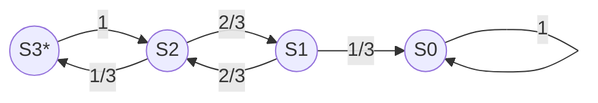

# Random Walk on a Cube

An ant is placed in a corner of a cube and cannot move. A spider starts from the opposite corner, and can move along the cube's edges in any direction $(x,y,z)$ with equal probability $1\over3$.   
On average, how many steps will the spider need to get to the ant?

### Using Markov chains
Modelling the problem as a Markov chain where each state represents the distance between the spider and the ant. In this case we have 4 possible states $Si$ as the distances $i$ can be $\{0,1,2,3\}$.  
When the spider is at the opposite corner of the cube, it is at a distance of 3 steps from the ant. It is in state $S3$.  When the spider reaches the state $S0$, the random walk ends, $S0$ is `absorbant`.

Markov chain diagram (start*):

We can build the transition matrix P as  :

$$\mathbf{P} = \left[\begin{array}
{rrr}
S3 \rarr S3 & S3 \rarr S2  & S3 \rarr S1  & S3 \rarr S0  \\
S2 \rarr S3 & S2 \rarr S2  & S2 \rarr S1  & S2 \rarr S0  \\
S1 \rarr S3 & S1 \rarr S2  & S1 \rarr S1  & S1 \rarr S0  \\
S0 \rarr S3 & S0 \rarr S2  & S0 \rarr S1  & S0 \rarr S0
\end{array}\right]
 = \left[\begin{array}
{rrr}
0  &  1  &  0  &  0  \\
1\over3  &  0  &  2\over3  &  0 \\
0  &  2\over3  &  0  &  1\over3  \\
0  &  0  &  0  &  1
\end{array}\right]
$$

